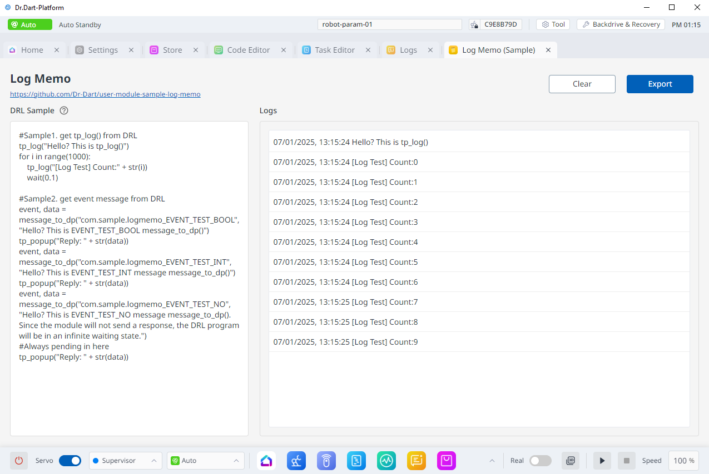

# user-module-sample-log-memo
This module is a sample module that provides log message and event message processing and storage functionality through DRL's tp_log() and message_to_dp() functions.

[Download Module (v1.0.0)](https://github.com/Dr-Dart/user-module-sample-log-memo/releases/tag/untagged-3b434b5b81ca66e38246)

## Overview
This module provides the following features:

- Through DRL's `tp_log()` function(Command Block in Task Editor Module: `Comment`):
  - Log message recording
  - Log message storage and extraction

- Through DRL's `message_to_dp()` function:
  - Event message communication test between DRL and module

## Usage Guide
1. Install `Dart-Platform` > `Store` module > `Code Editor` module
2. Copy DRL Sample Code and paste to `Code Editor` or `Custom Code in Task Editor`
3. Run Code at `Servo ON State` and `Auto Mode`
4. Click `Export Button` for saving the logs to file.
5. If you want to clear the logs, click `Clear Button`.

## Note.
1. This module is a sample module, so there may be limitations in functionality and performance.
2. It is recommended to use within a maximum period of 0.1 seconds and a few thousand lines.
3. When exporting, it outputs in json format.

## Features
1. Export logs to file(json format)
2. Implemented auto-scroll functionality for logs

## Used Dart-API
1. https://apis.drdart.io/classes/dart_api.Context.html
2. https://apis.drdart.io/interfaces/dart_api.IProgramManager.html
3. https://apis.drdart.io/classes/dart_api.Monitorable.html
4. https://apis.drdart.io/interfaces/dart_api.IFilePicker.html

